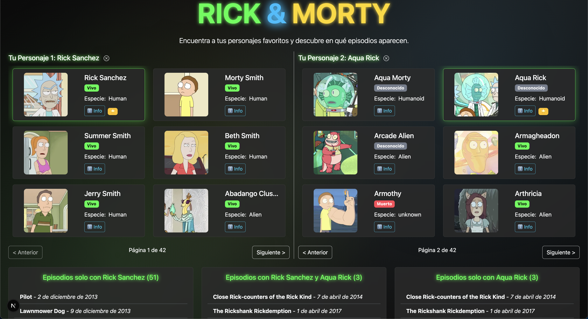

🚀 Rick and Morty - Conexa 

[](https://conexa-rick-morty.vercel.app/) [](LICENSE) [](https://nodejs.org/) [](https://nextjs.org/) [](https://www.typescriptlang.org/) [](https://getbootstrap.com/) [](https://jestjs.io/)

**Rick and Morty** es una aplicación frontend construida con **Next.js + TypeScript** que consume la [Rick and Morty API](https://rickandmortyapi.com/) y permite explorar personajes, ver detalles y episodios relacionados.

👉 **Demo en vivo:** [conexa-rick-morty.vercel.app](https://conexa-rick-morty.vercel.app/)

## ✨ Características

- 🌌 Exploración de personajes de Rick and Morty.  
- 📱 Diseño **responsive** con **Bootstrap**.  
- 🔍 Vista de detalle de personajes y episodios.  
- ⚡️ Organización de componentes con **Atomic Design**.  
- 🔄 Fetch de datos con **Axios**.  
- 🎯 Tipado fuerte con **TypeScript**.  
- 🧪 Suite de tests con **Jest**.  
- ☁️ Despliegue continuo con **Vercel**.

## 🛠 Stack Tecnológico

| Capa / Responsabilidad   | Tecnología usada                     |
|--------------------------|---------------------------------------|
| Framework / Base         | Next.js                              |
| Lenguaje                 | TypeScript                           |
| Estilos / UI             | Bootstrap + CSS Modules              |
| Arquitectura       | Atomic Design                        |
| Peticiones HTTP / API    | Axios + [Rick and Morty API](https://rickandmortyapi.com/) |
| Estado                   | Context API + Hooks personalizados   |
| Testing                  | Jest                                 |
| Despliegue               | Vercel                               |


## 📸 Preview




---

## 🚀 Instalación y ejecución

```bash
# Clonar repositorio
git clone https://github.com/colomarina/conexa.git
cd conexa

# Instalar dependencias
npm install

# Levantar en entorno de desarrollo
npm run dev

# Abrir en navegador
http://localhost:3000

```
## 🧪 Correr los tests

Ejecutar test suite con Jest

```bash
  npm run test
```


## Licencia

Este proyecto está bajo la licencia [MIT](https://choosealicense.com/licenses/mit/)
